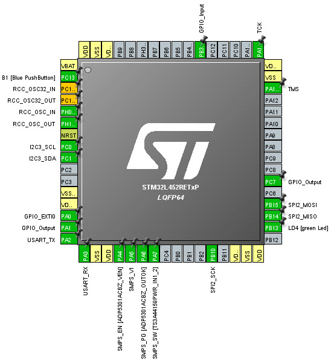
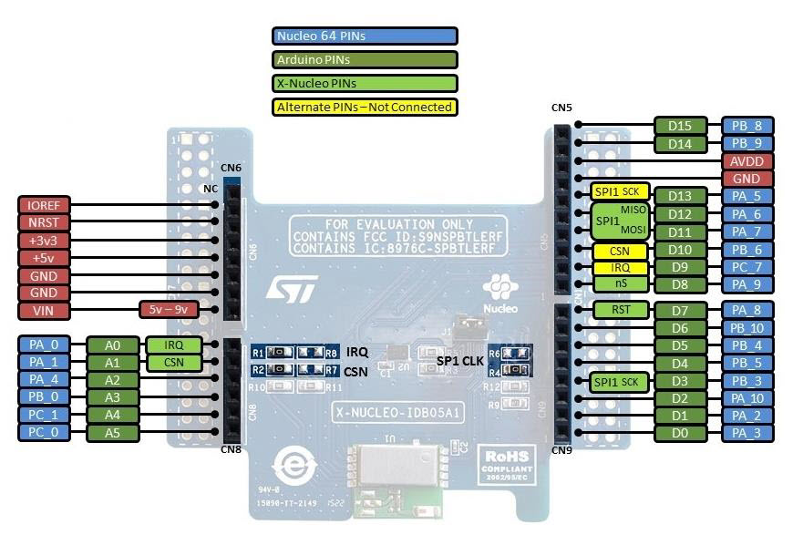
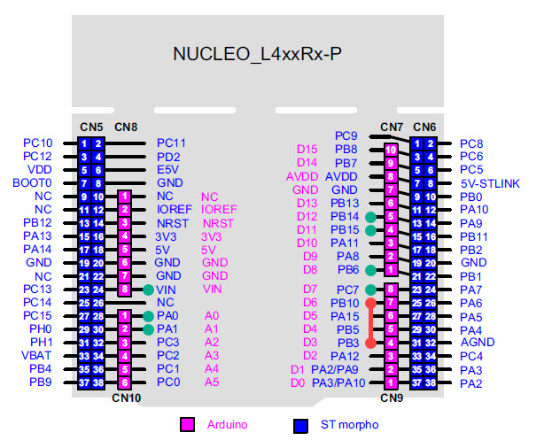

# Configurazione NUCLEO-L452RE + X-NUCLEO-IDB05A1 + AM2320 

Di seguito vengono descritti i passi da effettuare per la preparazione della scheda NUCLEO-L452RE, la scheda di espansione X-NUCLEO-IDB05A1 e il sensore AM2320.

## Configurazione del pinout della scheda NUCLEO-L452RE

* Per configurare il pinout della scheda NUCLEO-L452RE si è utilizzato il software STM32CubeMX.
* Si è configurato il pinout nel modo seguente:

### Adattamento del pinout della scheda NUCLEO-L452RE con la scheda IDB05A1

Visualizzando il pinout della scheda IDB05A1 si nota che non è compatibile con la scheda NUCLEO-L452RE. Occorre effettuare una rimappatura effettuando cablando in modo diverso le uscite.

Partendo dal pinout della scheda IDB05A1

confrontandolo con il pinout della scheda NUCLEO-L452RE si nota che il PIN dedicato all'SPI2 SCK (PB10) non coincide con il PIN richiesto dalla scheda IDB05A1 (PB3).

Per far coincidere il pinout si è impostato il PB3 come GPIO_Input in modo che il PIN sia configurato in alta impedenza.

Successivamente si è creato un ponte tra PB3 e PB10.

Di seguito si riporta in rosso il cablaggio effettuato mentre in verde sono evidenziati i PIN compatibili

In questo modo è possibile utilizzare la scheda IDB05A1 con la scheda NUCLEO-L452RE.

### Configurazione dell'applicazione

* Seguendo la [guida fornita da ST](https://www.st.com/content/ccc/resource/technical/document/user_manual/b3/37/62/19/ea/9f/48/4d/DM00169392.pdf/files/DM00169392.pdf/jcr:content/translations/en.DM00169392.pdf), si è utilizzato il software STM32CubeMX per creare il progetto di partenza.
* Si è configurata l'I2C3 per interfacciare il sensore AM2320 mentre si sono configurate SPI2 e USART2 per la scheda IDB05A1.
* Per lo sviluppo e il deploy dell'applicazione si è utilizzato l'IDE Eclipse.