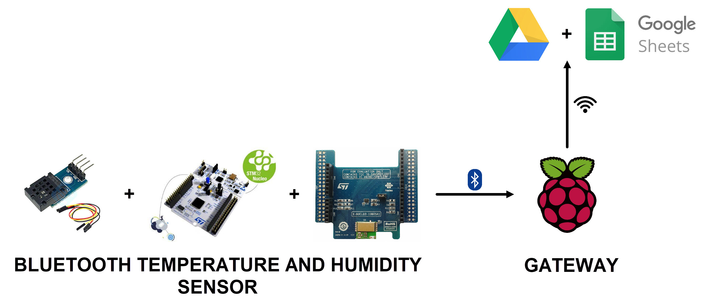

# Bluetooth Gateway

Analisi, progettazione e sviluppo di un gateway bluetooth e di un sensore di temperatura e di umidità bluetooth.

Il progetto è stato realizzato per il corso di Sistemi di Elaborazione dell'Università degli Studi di Ferrara.

Lo schema del sistema progettato è il seguente:

* Il sensore di temperatura e di umidità resta sempre disponibile via bluetooth e, se connesso con il gateway, invia i valori campionati ogni 10 secondi.
* Il gateway si connette via bluetooth con il sensore di temperatura e di umidità rimanendo in ascolto delle sue notifiche.
* Il gateway, connesso a internet tramite Wi-Fi, invia ogni notifica ricevuta in un foglio di calcolo di Google Drive.
* Accedendo al foglio di calcolo si può visualizzare l'andamento di temperatura e di umidità del sensore.

## Prerequisiti

Per la realizzazione del progetto è necessario disporre di:
* una connessione Internet
* un account Google
* una [Raspberry Pi 3 Model B+](https://www.raspberrypi.org/products/raspberry-pi-3-model-b-plus/)
* una [NUCLEO-L452RE](https://www.st.com/en/evaluation-tools/nucleo-l452re.html)
* una [X-NUCLEO-IDB05A1](https://www.st.com/en/ecosystems/x-nucleo-idb05a1.html)
* un [AM2320](Doc/Pdf/AM2320.pdf)

## Come iniziare

Per configurare i vari componenti seguire le guide seguenti:
* [Configurazione NUCLEO-L452RE + X-NUCLEO-IDB05A1 + AM2320](Doc/Configurazione-NUCLEO.md)
* [Configurazione Raspberry Pi 3 Model B+](Doc/Configurazione-Raspberry-Pi.md)
* [Configurazione Google Drive e Google Sheets](Doc/Configurazione-Google-Drive-e-Google-Sheets.md)

## License

Questo progetto è concesso in licenza GNU General Public License - si veda il file [LICENSE](LICENSE) per i dettagli.